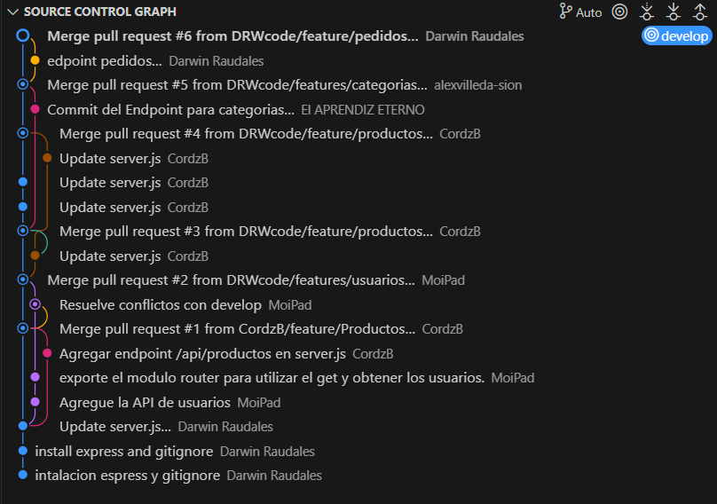
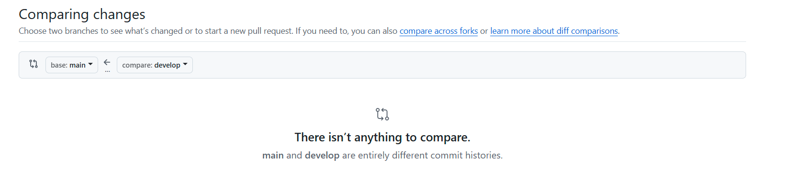
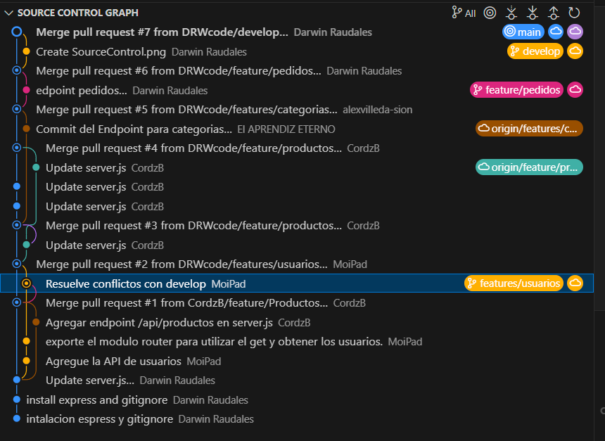

# Apiget

Tarea con el objetivo de practicar el desarrollo de Apis con Express.js y Uso de GitFlow 

 Esta esla captura del flujo de trabajo, 


Hubo un conflicto a la hora de poder hacer git push de develop a main, por lo que se usó este comando, pero el resultado es que main aparece como copia idéntica de develop, aunque sí se desarrolló por separado.  


```bash
git checkout develop
git branch -f main
git checkout main
git push origin main --force
```

